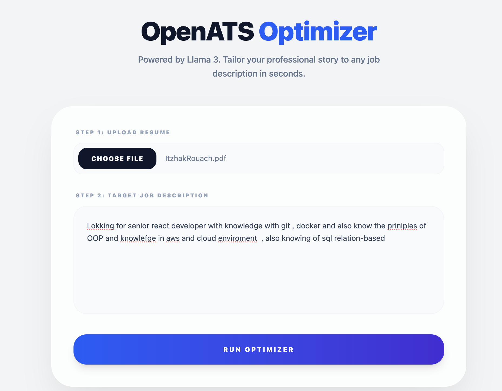
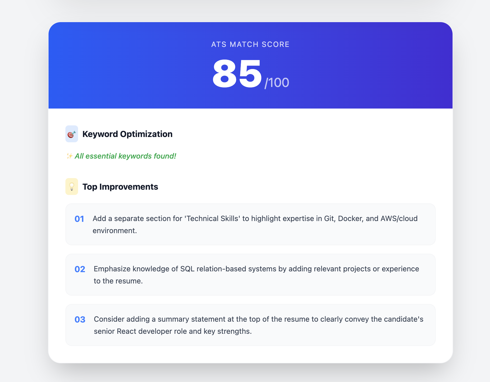
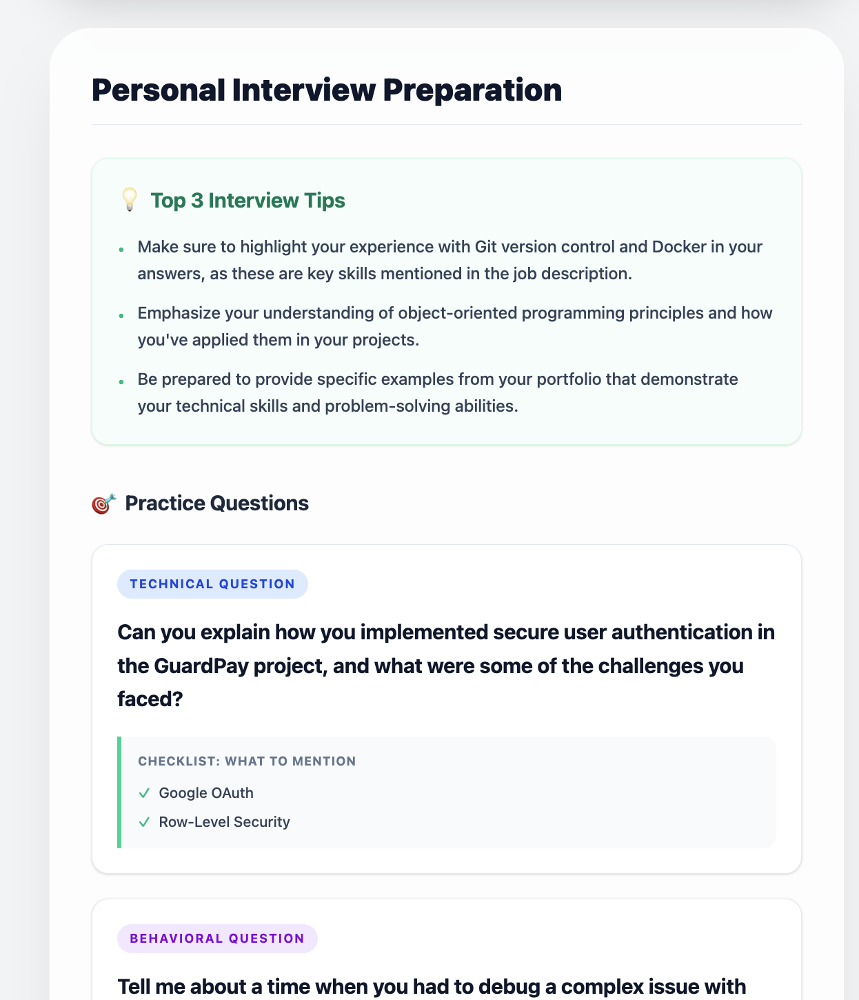

# 🎯 OpenATS Optimizer

Full-stack application that helps users optimize their resumes for Applicant Tracking Systems (ATS). By leveraging a localized LLM (Llama 3), this tool securely analyzes PDF resumes against target job descriptions and provides actionable, keyword-focused feedback without sending sensitive personal data to the cloud.

## 🚀 Tech Stack

- **Frontend:** React, TypeScript, Vite, Tailwind CSS v4
- **Backend:** Node.js, Express, TypeScript, Multer
- **AI Integration:** Ollama (running Llama 3 locally)
- **Architecture:** Clean Architecture (Controllers, Use Cases, Webserver routing)
- **DevOps:** Docker, Docker Compose (Multi-stage builds, Internal Networking)

## 🧠 Core Features

- **Local AI Inference:** Uses Ollama to run Llama 3 entirely on your machine, ensuring zero data leakage.
- **Secure PDF Parsing:** Extracts text from uploaded resumes in memory (RAM) without writing temporary files to the disk.
- **Clean Architecture:** Backend logic is strictly separated into Use Cases and Controllers for high maintainability and easy testing.
- **Dockerized Environment:** The entire stack (Frontend, Backend, and AI) runs in isolated containers with automated internal networking.

## 📂 Project Structure

\`\`\`text
open-ats-optimizer/
├── client/ # React frontend
│ ├── src/ # UI Components and App logic
│ └── Dockerfile # Multi-stage Nginx build
├── server/ # Node.js backend
│ ├── src/
│ │ ├── domain/ # Enterprise logic, Entities, and TS Interfaces
│ │ ├── use-cases/ # Application business rules (e.g., AnalyzeResume)
│ │ └── infrastructure/ # Frameworks and external tools
│ │ ├── controllers/# API Request handlers (analyzeController)
│ │ ├── webserver/ # Express app and routing (routes.ts)
│ │ └── ai/ # External service integrations (OllamaService)
│ ├── server.ts # Application entry point
│ └── Dockerfile # Node.js runtime setup
└── docker-compose.yml # Orchestrates the 3 containers
\`\`\`

## Project Demo Gallery

 

  
  
  

## 🐳 How to Run (Docker)

You don't need to install Node modules manually. The entire application is containerized.

### Prerequisites

- [Docker Desktop](https://www.docker.com/products/docker-desktop/) installed and running.

### Quick Start

1.  **Clone the repository:**
    \`\`\`bash
    git clone https://github.com/yourusername/open-ats-optimizer.git
    cd open-ats-optimizer
    \`\`\`

2.  **Spin up the containers:**
    \`\`\`bash
    docker compose up --build
    \`\`\`

3.  **Pull the AI Model (First time only):**
    Open a new terminal window and tell the Ollama container to download the Llama 3 model:
    \`\`\`bash
    docker exec -it ollama_service ollama pull llama3
    \`\`\`

4.  **Open the App:**
    Navigate to \`http://localhost\` in your browser.

_(Note: The first analysis might take a moment as the AI model loads into memory)._

## 🛑 Stopping the Application

To cleanly stop the application and remove the containers (your AI model data will remain safely stored in a Docker volume):
\`\`\`bash
docker compose down
\`\`\`
